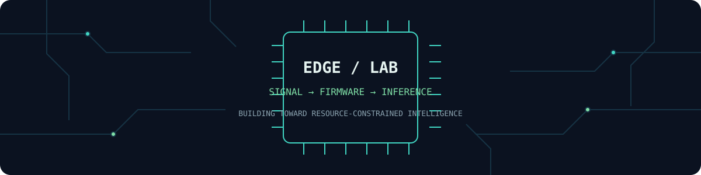

<!-- Profile README for github.com/soumyajit11 — keep claims tied to shipped work. -->

<p align="center">
  
</p>

<h1 align="center">Soumyajit</h1>
<p align="center">
  <strong>Electrical Engineer → Embedded Systems · Embedded Software · TinyML / Edge AI</strong><br />
  Kolkata, India · Turning signals and algorithms into dependable systems
</p>

<p align="center">
  <a href="https://github.com/soumyajit11"></a>
  
  
</p>

---

## About

I’m an Electrical Engineering graduate from **Heritage Institute of Technology, Kolkata**, currently working as a **Sales Engineer at Marathon Electric Motors India Ltd.** My background in electrical engineering and customer-facing industrial work informs my transition toward embedded systems and edge intelligence.

I’m building depth in **C/C++, microcontrollers, real-time systems, embedded Linux, signal processing, computer vision, and neural networks for resource-constrained devices**. I have programming experience across C, C++, Python, Java, React, and Django, and have worked with machine-learning frameworks. I’m especially interested in the path from sensor data to reliable on-device inference.

## Embedded systems stack

| Area | Current focus |
|---|---|
| Firmware | C and C++; memory, concurrency, interfaces, and maintainable low-level code |
| Microcontrollers | Peripheral bring-up, GPIO, timers, ADC, PWM, interrupts, and DMA *(hands-on board details: add when verified)* |
| Real-time systems | RTOS concepts, task scheduling, synchronization, latency, and deterministic behavior |
| Embedded Linux | Linux fundamentals, processes, device interfaces, and deployment *(specific boards and tools: add when verified)* |
| Protocols | UART, I²C, SPI, CAN, and TCP/IP concepts *(mark each as practiced only after documenting a project)* |
| Debugging | GDB, logs, assertions, logic-analyzer/oscilloscope workflows *(tools used: add when verified)* |

## Edge AI stack

- **Model development:** Python, PyTorch, TensorFlow
- **On-device direction:** TensorFlow Lite for Microcontrollers (TFLM), model conversion, operator constraints, and memory-aware deployment
- **Efficiency topics:** post-training quantization, integer inference, model size, RAM/flash budgets, and latency/accuracy trade-offs
- **Vision topics:** image pipelines, preprocessing, classification/detection concepts, and evaluating computer-vision models at the edge
- **Engineering lens:** measure the complete pipeline on the target device before making performance claims

> These are areas of experience and active learning, not a claim that every listed tool has shipped in a hardware deployment.

## Featured project

### TrueSight — deepfake detection

A completed deepfake-detection project. The public repository currently identifies itself as a **React + Vite** starter in its README; project-specific model, dataset, inference, and evaluation details are not documented there. The summary below intentionally leaves those details open rather than implying unverified results.

**Architecture to document**

```text
Input media → preprocessing → [model / inference implementation] → [score or class] → [user-facing result]
```

| Measurement / detail | Verified value |
|---|---|
| Dataset and split | `[add dataset, source, and split policy]` |
| Model and runtime | `[add architecture, framework, and version]` |
| Evaluation | `[add metrics and held-out evaluation method]` |
| Inference latency / hardware | `[add device, measurement method, and result]` |
| Repository | [soumyajit11/TrueSight](https://github.com/soumyajit11/TrueSight) |

No accuracy, latency, or hardware benchmark is claimed until measured and recorded in the project documentation.

## Current builds

These are **planned learning builds**, not completed projects. Publish each as a project only after implementation and measurement.

1. **Sensor-to-serial firmware** — capture a sensor signal, process it in C/C++, and document timing, sampling, and debugging.
2. **RTOS task and protocol exercise** — implement a small task-based design and document scheduling, synchronization, and protocol behavior.
3. **TinyML deployment study** — take a small model through quantization and TFLM deployment; record flash, peak RAM, latency, and model quality on the named target.
4. **Vision at the edge** — profile a compact computer-vision pipeline and report preprocessing, inference, and end-to-end timing separately.

## Learning roadmap

- **Firmware foundations:** strengthen C/C++, data representation, pointers, build systems, and unit-level reasoning.
- **MCU practice:** work through peripherals, interrupts, DMA, and board bring-up; publish the board and measurement setup with each build.
- **Real-time design:** implement RTOS tasks, synchronization, timing analysis, and fault handling.
- **Embedded Linux:** learn cross-compilation, device interfaces, system services, and deployment on a documented target.
- **Edge inference:** build a reproducible PyTorch/TensorFlow workflow, convert and quantize models, then deploy with TFLM where supported.
- **Evidence:** attach source, setup steps, measurement conditions, and limitations to each project.

## GitHub activity

<p align="center">
  
  
</p>

*Stats are served dynamically by a third-party service and may be unavailable or cached. They are not a substitute for project evidence.*

## Contact

- **GitHub:** [@soumyajit11](https://github.com/soumyajit11)
- **LinkedIn:** `[https://www.linkedin.com/in/soumyajit-banik-7312b1256]`
- **Email:** `[baniksoumya11@gmail.com]`
- **Portfolio / resume:** 

---

<p align="center"><sub>Build carefully. Measure honestly. Ship what you can explain.</sub></p>

<!--
Setup
1. Create or open the public repository named exactly `soumyajit11` under the `soumyajit11` account.
2. Put this file at the repository root as `README.md` and add `lab-header.svg` alongside it.
3. Replace the bracketed contact and project-detail placeholders with verified information, or remove those rows.
4. Keep TrueSight under Featured only if it is still representative; add hardware projects after they are implemented and measured.
5. Check the profile on mobile and confirm the SVG and remote stats images load. The SVG is a local static asset; no JavaScript or custom CSS is used.
-->
